# Churn Prediction Model Architecture

## Mermaid AI Code for Architecture Diagram

```mermaid
graph TB
    %% Data Sources
    subgraph "Data Sources"
        A1[Customer Data<br/>CSV Files]
        A2[Real-time API<br/>Customer Events]
        A3[Database<br/>Historical Data]
    end

    %% Data Processing Layer
    subgraph "Data Processing Layer"
        B1[Data Ingestion<br/>API Endpoints]
        B2[Data Validation<br/>Schema Check]
        B3[Data Cleaning<br/>Missing Values<br/>Outliers]
    end

    %% Feature Engineering
    subgraph "Feature Engineering"
        C1[Raw Feature<br/>Extraction]
        C2[Advanced Features<br/>Behavioral Patterns<br/>Risk Indicators]
        C3[Normalization<br/>0-1 Scaling]
        C4[Feature Selection<br/>Correlation Analysis]
    end

    %% Machine Learning Pipeline
    subgraph "ML Pipeline"
        D1[Model Training<br/>Random Forest<br/>Gradient Boosting]
        D2[Cross-Validation<br/>5-Fold CV]
        D3[Hyperparameter<br/>Tuning]
        D4[Model Evaluation<br/>Accuracy: 95%<br/>F1-Score: 0.92]
    end

    %% Model Deployment
    subgraph "Model Deployment"
        E1[Model Serialization<br/>Joblib/Pickle]
        E2[Model Registry<br/>Version Control]
        E3[Model Loading<br/>Runtime Optimization]
    end

    %% Prediction Service
    subgraph "Prediction Service"
        F1[Flask API<br/>REST Endpoints]
        F2[Batch Processing<br/>CSV Upload]
        F3[Real-time Prediction<br/>Single Customer]
        F4[Error Handling<br/>Fallback Logic]
    end

    %% Business Logic Layer
    subgraph "Business Logic"
        G1[Risk Assessment<br/>High/Medium/Low]
        G2[Customer Profiling<br/>Behavioral Analysis]
        G3[CLV Estimation<br/>Lifetime Value]
        G4[Retention Strategies<br/>Actionable Insights]
    end

    %% User Interface
    subgraph "User Interface"
        H1[Web Dashboard<br/>React/Flask Templates]
        H2[Single Prediction<br/>Customer Form]
        H3[Batch Analysis<br/>CSV Upload]
        H4[Results Visualization<br/>Charts & Reports]
    end

    %% Analytics & Monitoring
    subgraph "Analytics & Monitoring"
        I1[Performance Metrics<br/>Accuracy Tracking]
        I2[Model Drift Detection<br/>Retraining Triggers]
        I3[Usage Analytics<br/>API Monitoring]
        I4[Business Impact<br/>ROI Measurement]
    end

    %% Data Flow
    A1 --> B1
    A2 --> B1
    A3 --> B1

    B1 --> B2 --> B3 --> C1
    C1 --> C2 --> C3 --> C4

    C4 --> D1
    D1 --> D2 --> D3 --> D4

    D4 --> E1 --> E2 --> E3

    E3 --> F1
    F1 --> F2
    F1 --> F3
    F1 --> F4

    F2 --> G1
    F3 --> G1
    G1 --> G2 --> G3 --> G4

    G4 --> H1
    H1 --> H2
    H1 --> H3
    H1 --> H4

    H4 --> I1 --> I2 --> I3 --> I4

    %% Styling
    classDef dataSource fill:#e1f5fe,stroke:#01579b,stroke-width:2px
    classDef processing fill:#f3e5f5,stroke:#4a148c,stroke-width:2px
    classDef ml fill:#e8f5e8,stroke:#1b5e20,stroke-width:2px
    classDef deployment fill:#fff3e0,stroke:#e65100,stroke-width:2px
    classDef api fill:#fce4ec,stroke:#880e4f,stroke-width:2px
    classDef business fill:#f3e5f5,stroke:#4a148c,stroke-width:2px
    classDef ui fill:#e0f2f1,stroke:#004d40,stroke-width:2px
    classDef analytics fill:#fff8e1,stroke:#f57f17,stroke-width:2px

    class A1,A2,A3 dataSource
    class B1,B2,B3 processing
    class C1,C2,C3,C4 processing
    class D1,D2,D3,D4 ml
    class E1,E2,E3 deployment
    class F1,F2,F3,F4 api
    class G1,G2,G3,G4 business
    class H1,H2,H3,H4 ui
    class I1,I2,I3,I4 analytics
```

## How to Use This Diagram

1. **Copy the Mermaid code** above
2. **Go to Mermaid AI**: Visit [https://mermaid.live/](https://mermaid.live/) or [https://mermaid.ink/](https://mermaid.ink/)
3. **Paste the code** into the editor
4. **Generate the diagram** - it will create a visual architecture diagram

## Architecture Overview

This churn prediction system follows a comprehensive ML pipeline:

### 🔄 Data Flow:
1. **Data Collection** → Multiple sources (CSV, API, Database)
2. **Data Processing** → Validation, cleaning, and preprocessing
3. **Feature Engineering** → Advanced behavioral pattern extraction
4. **Model Training** → Ensemble methods with 95% accuracy
5. **Model Deployment** → Serialized models with version control
6. **Prediction Service** → REST API for real-time and batch predictions
7. **Business Logic** → Risk assessment and retention strategy generation
8. **User Interface** → Web dashboard with visualizations
9. **Analytics** → Performance monitoring and model drift detection

### 🎯 Key Features:
- **95% Prediction Accuracy** with F1-Score of 0.92
- **Real-time & Batch Processing** capabilities
- **Advanced Feature Engineering** with behavioral pattern analysis
- **Comprehensive Risk Assessment** (High/Medium/Low risk levels)
- **Customer Lifetime Value Estimation**
- **Actionable Retention Strategies**
- **Interactive Visualizations** with charts and reports

### 🛠️ Technology Stack:
- **Backend**: Python Flask, scikit-learn, pandas, numpy
- **ML Models**: Random Forest, Gradient Boosting
- **Frontend**: HTML, Tailwind CSS, JavaScript, Chart.js
- **Data Processing**: Advanced feature engineering pipeline
- **Deployment**: RESTful API with error handling

The system is designed for enterprise-scale churn prediction with comprehensive analytics and actionable insights for customer retention strategies.